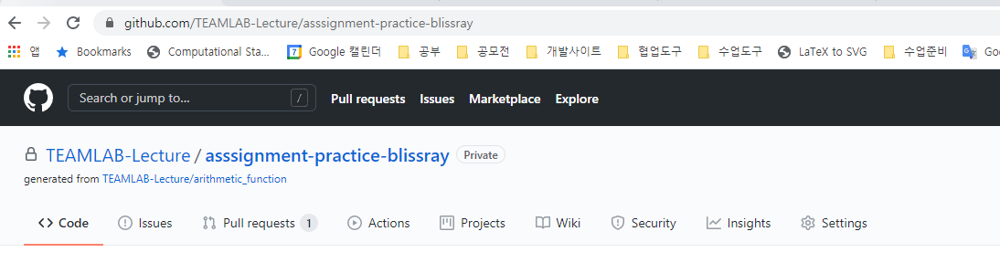
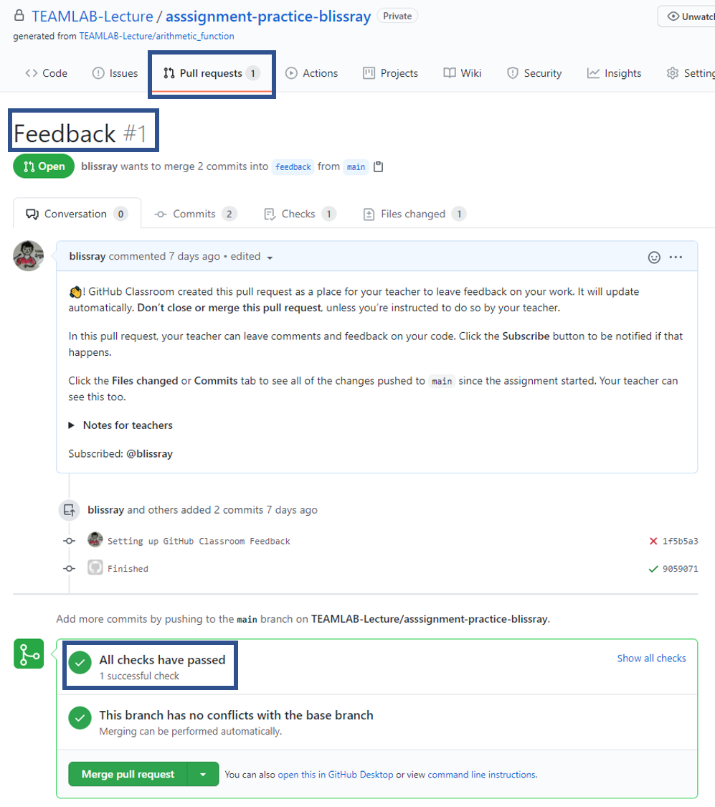

# Homework - Text Processing I

## 개요

본 과제에서는 string 다루는 방법을 학습합니다. 다른 자료구조를 필요시에 사용하시면 됩니다. 본 과제에서 풀어야 할 문제는 아래 2가지가 있습니다.

## 숙제 다운로드 방법

1. 아래링크를 클릭하여 숙제 github repository를 복사함
    [https://classroom.github.com/a/ZMt5NpxJ](https://classroom.github.com/a/ZMt5NpxJ)
2. 아래 코드를 사용하여 숙제 코드 github repository를 자신의 컴퓨터로 클론함
    ```
    git clone <레포지토리 URL>
    ```
    
3. 해당 폴더로 이동하여 자신의 코드를 수정함

## 함수 리스트

- normalize

```
인풋으로 받는 스트링에서 정규화된 스트링을 반환함
아래의 요건들을 충족시켜야함
* 모든 단어들은 소문자로 되어야함
* 띄어쓰기는 한칸으로 되어야함
* 앞뒤 필요없는 띄어쓰기는 제거해야함

    Parameters:
        input_string (string): 영어로 된 대문자, 소문자, 띄어쓰기, 문장부호, 숫자로 이루어진 string
        ex - "This is an example.", "   EXTRA   SPACE   "

    Returns:
        normalized_string (string): 위 요건을 충족시킨 정규회된 string
        ex - 'this is an example.'

    Examples:
        >>> import text_processing as tp
        >>> input_string1 = "This is an example."
        >>> tp.normalize(input_string1)
        'this is an example.'
        >>> input_string2 = "   EXTRA   SPACE   "
        >>> tp.normalize(input_string2)
        'extra space'
```

- no_vowels
```
인풋으로 받는 스트링에서 모든 모음 (a, e, i, o, u)를 제거시킨 스트링을 반환함

    Parameters:
        input_string (string): 영어로 된 대문자, 소문자, 띄어쓰기, 문장부호로 이루어진 string
        ex - "This is an example."

    Returns:
        no_vowel_string (string): 모든 모음 (a, e, i, o, u)를 제거시킨 스트링
        ex - "Ths s n xmpl."

    Examples:
        >>> import text_processing as tp
        >>> input_string1 = "This is an example."
        >>> tp.normalize(input_string1)
        "Ths s n xmpl."
        >>> input_string2 = "We love Python!"
        >>> tp.normalize(input_string2)
        ''W lv Pythn!'
```

## 제출방법
1. 숙제 코드를 수정한 후 commit 수행
   ```
   git add *.py
   git commit -m "Update my code"
   ```
2. 자신의 code repository에 코드를 push함
    ```
    git push origin main
    ```
3. 자신의 코드가 all pass를 받았는지 확인함
    